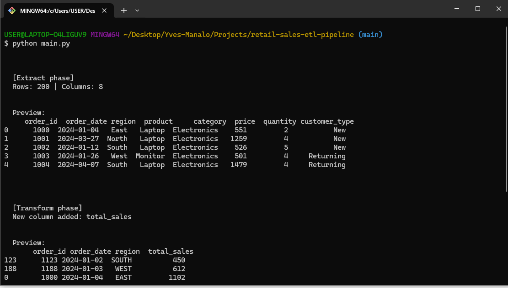
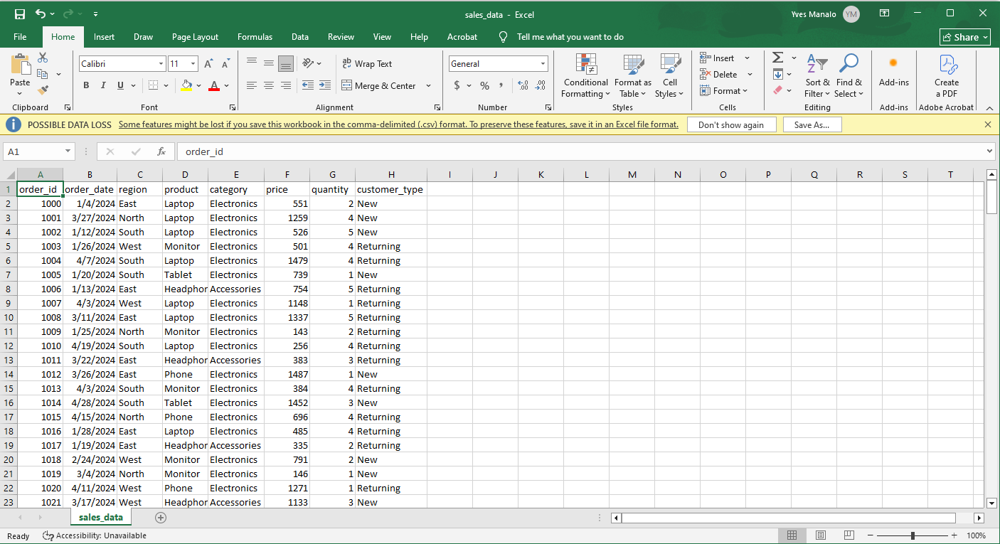
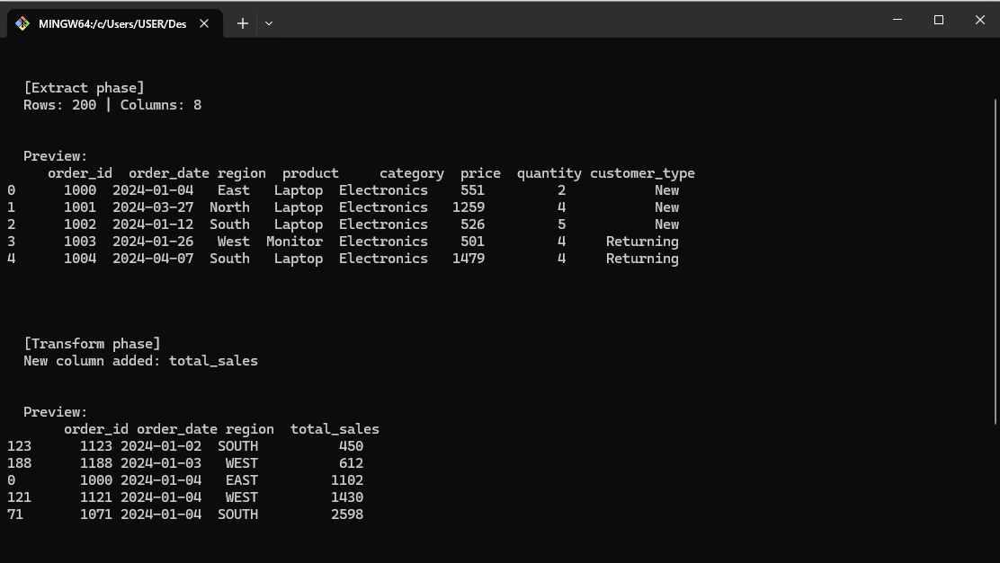
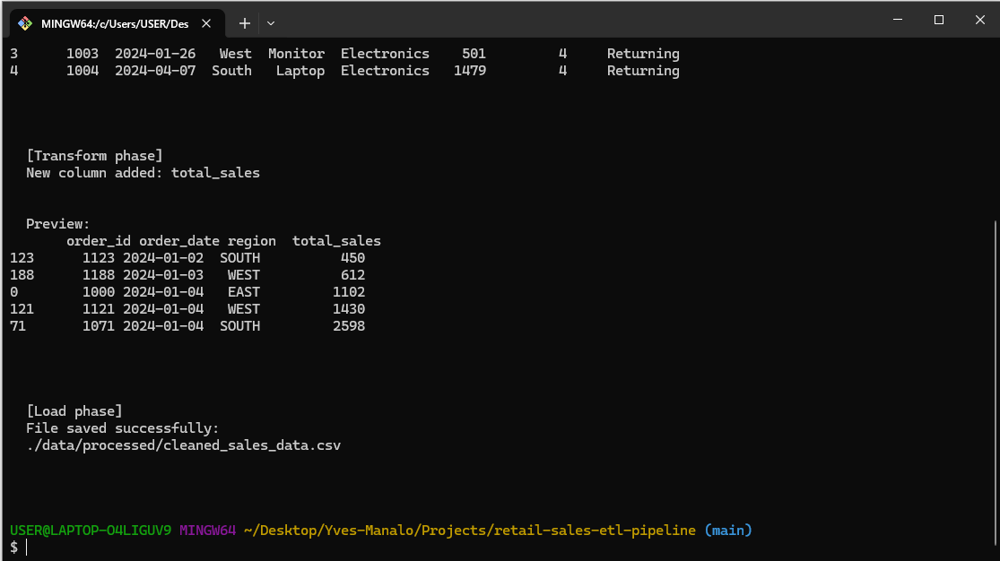
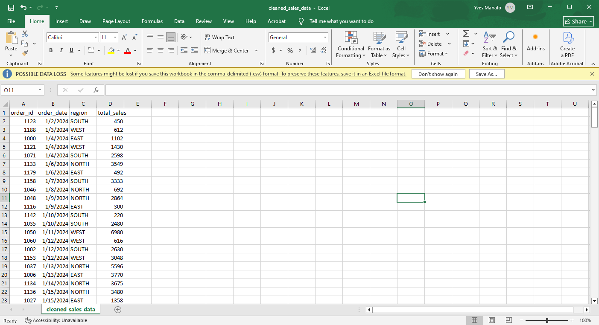

# Retail Sales ETL Pipeline (Python)



## Project Overview

This project demonstrates an end-to-end **ETL (Extract, Transform, Load) pipeline** built using Python. The pipeline processes raw retail sales data from a CSV file, performs data cleaning and transformation, and outputs a structured dataset ready for analysis.

## Features

- Extracts raw data from a CSV file
- Cleans and standardizes dataset
- Handles duplicate detection
- Performs feature engineering `(total_sales)`
- Outputs cleaned dataset to a new file
- Generates simple business insights

## Project Structure

```
retail-sales-etl-pipeline/
│
├── data/
│   ├── processed/
│   │   └── cleaned_sales_data.csv
│   └── raw/
│       └── sales_data.csv
│
├── etl/
│   ├── extract.py
│   ├── load.py
│   └── transform.py
│
├── images/
│   ├── cleaned_sales_data.png
│   ├── extract-and-transform-phase.png
│   ├── load-phase.png
│   ├── retail-sales-etl-pipeline.png
│   └── sales_data.png
│
├── .gitignore
├── main.py
└── README.md
```

## Dataset Information



- File: `sales_data.csv`
- Records: ~200 rows
- Type: Simulated retail sales data
- Fields include:
  - Order ID
  - Order Date
  - Region
  - Product & Category
  - Price & Quantity
  - Customer Type

## ETL Pipeline Breakdown

**1. Extract**

- Reads raw CSV file
- Displays dataset preview and structure

**2. Transform**

- Converts order_date to datetime format
- Creates new column: `total_sales = price × quantity`
- Standardizes text fields (`region`)
- Removes duplicate records (if any)
- Sorts data for consistency

**3. Load**

- Saves cleaned dataset to:

  `data/processed/cleaned_sales_data.csv`

## Data Quality Checks

- Verified dataset structure and column consistency
- Checked for duplicate records using `.duplicated()`
- Confirmed no duplicate rows present in dataset
- Ensured correct data types for all columns

## Outputs

### Extract and Transform Phase



### Load Phase



### cleaned_sales_data.csv



## Key Learnings

- Understanding of ETL vs ELT concepts
- Building modular data pipelines in Python
- Data cleaning and transformation techniques using pandas
- Importance of data validation and quality checks
- Structuring projects for readability and maintainability
